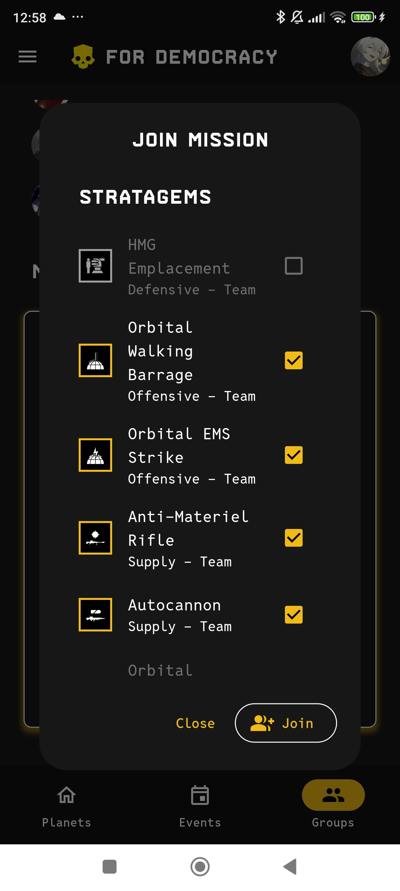

# For-democracy

A mobile app designed to help players organize and participate in events for the game [Helldivers 2](https://store.steampowered.com/app/553850/HELLDIVERS_2).

This is our last project for our 5th year at ESGI (second semester).

## Content

- [For-democracy](#for-democracy)
  - [Content](#content)
  - [Features](#features)
    - [Mobile](#mobile)
      - [Mobile features](#mobile-features)
      - [Screenshots](#screenshots)
    - [API](#api)
      - [API features](#api-features)
    - [Web](#web)
      - [Web features](#web-features)
  - [Prerequisites](#prerequisites)
  - [Installation](#installation)
  - [Services](#services)
  - [Authentication](#authentication)
  - [Commands](#commands)
  - [Swagger](#swagger)

## Features

- A mobile app to display the different planets, events and groups
- An API to process the official Helldivers data and expose it
- A web administration panel to manage available features in the mobile app

### Mobile

The main visual part of the project. It is used by players to organize and participate in events.

[Download the app](https://drive.google.com/file/d/1fnf5W44soaGUnL2ZC2K9dvkg5DYzdVFT/view?usp=sharing) (Android only).

#### Mobile features

- Made with [Flutter](https://flutter.dev)
- Fully translated in English and French
- Fully themed with Helldivers colors and fonts
- Easy to use and fast
- Custom galaxy map from the game
- List of events in real-time
- Steam OAuth
- Create and join groups
- Create private groups and use a code to invite friends
- Plan missions with objectives in your group
- Join your friends' missions and choose your stratagems
- And more !

#### Screenshots

> [!NOTE]
> Also see the [Mobile README](mobile/README.md) for more information.

### API

A RESTful API to process the official Helldivers data and expose it through endpoints.

#### API features

- Made with [Go](https://go.dev) and [Gin](https://github.com/gin-gonic/gin)

> [!NOTE]
> Also see the [API README](api/README.md) for more information.

### Web

A web administration panel to manage the available features in the mobile app.

#### Web features

- Made with [Flutter](https://flutter.dev)
- Login with password
- Enable or disable features for the mobile app

> [!NOTE]
> Also see the [Web README](web/README.md) for more information.

## Prerequisites

- [Flutter](https://flutter.dev/docs/get-started/install)
- [Android Studio](https://developer.android.com/studio) or Android SDK
- [Docker](https://www.docker.com/get-started)
- [Docker Compose](https://docs.docker.com/compose/install/)
- [GNU Make](https://www.gnu.org/software/make/)

## Installation

> [!NOTE]  
> The Docker containers are used to run the API and the database. You will have to run the flutter mobile and wep app separately on your local machine.

1. Clone the repository
2. (Optional) Add `compose.override.yml` to override the default compose configuration
3. Run `make start`
4. Run `make db-migrate` to load the database migrations
5. Run `make collector` to load the data from helldivers API
6. Go to [http://localhost:5000](http://localhost:5000) to access Golang API

After the first run, you can use `make stop` & `make up` to quickly stop and start the containers.
All the available commands are listed in the `Makefile`, you can use `make` or `make help` to list them all. Read the [commands section](#commands) for more information.

if you want to reset the database, you can use `make db-reset` it will remove the database and create a new one and load migrations, and run `make collector` to load the data from helldivers API.
You can also run a CronJob to load the events from the helldivers API every minute by running `make cron`, be sure to have run `make collector` before running the cron job.

## Services

All the services used by the project.

> [!NOTE]  
> Some services are only available in dev. They will never be used in production or even test environments.

| Service name | Host             | Aliases       | Ports | Description                                              |
| ------------ | ---------------- | ------------- | ----- | -------------------------------------------------------- |
| `api`        | `localhost:5000` | `fd-api`      |       | The Golang API                                           |
| `postgres`   |                  | `fd-postgres` |       | The database used by the API.                            |
| `adminer`    | `localhost:8080` | `fd-adminer`  |       | Used to manage PostgreSQL easily. Only available in dev. |

## Authentication

We use simple username/password for development purposes.

| Service               | Username | Password |
| --------------------- | -------- | -------- |
| `adminer`, `postgres` | `root`   | `root`   |

## Commands

> [!NOTE]  
> All the commands are available in the `Makefile`. You can use `make` or `make help` to list all the available commands.
> If you want to add a new command, please add it to the `Makefile` and document it here.

## Swagger

The API is documented using Swagger. You can access the documentation by going to [http://localhost:5000/swagger/index.html](http://localhost:5000/swagger/index.html).
